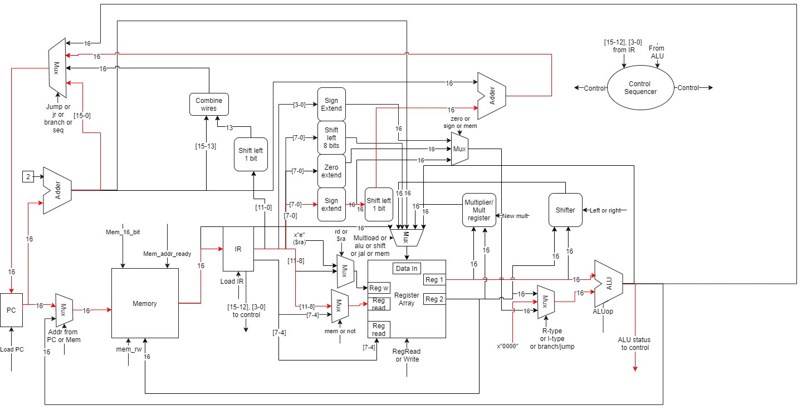

# Processor Principles of Operation

### Wonhyuk Choi

* Word size: $16$
* Registers: Sixteen $16$- bit GPR's 
* Register breakdown:
  * $0 Zero register : alias \$0
  * $1, \$2 return value registers : alias \$r0, \$r1
  * $3, \$4 parameter registers : alias \$v0, \$v1
  * $5~ \$8 temporary registers : alias \$t0 ~ 3
  * \$9 ~ \$12 saved registers : alias \$s0 ~ 3
  * $13 stack pointer register : alias \$sp
  * $14 return address register : alias \$ra
  * $15 assembler register: alias \$me
* Program Counter as  separate register
* Intstruction Register as separate register
* No PSW
* Memory stored by bytes (byte addressing)
* Only load word, store word functions access memory
* Shift functions:
  * Includes logical left and right
  * Allows shifting of multiple bits at once
  * Shift amount determined by value in given register
  * No rotation of bits 
* Hardware multiplier 
  * Logarithmic multiplier
  * For 16-bit words, it takes 4 gate delays for an output
* Includes standard conditional and branching operations 
* All operations are unsigned 

## R-type instructions

| Op Name | Description | Opcode (4 bit) | Reg. dest. (4 bit) | Reg. source (4 bit) | Funct code (4 bit) |
|------|------------------------|----------------|--------------------|---------------------|--------------------|
| Add | Add | 0000 | rd | rs | 0000 |
| Sub | Subtract | 0000 | rd | rs | 0001 |
| Slt | Set on less than | 0000 | rd | rs | 0010 |
| Cp | Copy | 0000 | rd | rs | 0011 |
| And | Bitwise and | 0000 | rd | rs | 0100 |
| Or | Bitwise or | 0000 | rd | rs | 0101 |
| Xor | Bitwise xor | 0000 | rd | rs | 0110 |
| Nor | Bitwise nor | 0000 | rd | rs | 0111 |
| Sll | Shift left logical | 0000 | rd | rs | 1000 |
| Srl | Shift right logical | 0000 | rd | rs | 1001 |

### Details
* Add: 
  \$rd = \$rd + \$rs
  Adds the contents of register \$rs and \$rd and places it in register \$rd. 
  
* Sub: 
  \$rd = \$rd - \$rs
  Subtracts the contents of register \$rs from \$rd and places it in register \$rd. 
  
* Sub signed: 
  \$rd = \$rd - \$rs
  Subtracts the signed contents of register \$rs from \$rd and places it in register \$rd. 
  
* Copy:
  \$rd = \$rs. 
  Nothing more, nothing less, just copies the contents of one register to another.
  
* Slt:
  
  `C` equivalent: \$rd = \$rd < \$rs ? 0 : 1 
  
  Sets \$rd to 0 if \$rd < \$rs. 
  
  Otherwise, sets \$rd to 1. 
  
* And:
  Bitwise AND of \$rd and \$rs and places the result in \$rd.
  
* Or:
  Bitwise OR of \$rd and \$rs and places the result in \$rd. 
  
* Xor:
  Bitwise XOR of \$rd and \$rs and places the result in \$rd.
  
* Nor:
  Bitwise NOR of \$rd and \$rs and places the result in \$rd.
  
* Shift left logical
  Shifts the contents of \$rd **left** by rs bits (not from register \$rs) and places the result in \$rd.
  The new bits on the "right" are filled with 0s.  
  
* Shift right logical
  Shifts the contents of \$rd **right** by rs bits (not from register \$rs) and places the result in \$rd.
  The new bits on the "left" are filled with 0s.  

  

## R-type multiply operations

| Op Name | Description | Opcode (4 bit) | Reg. source 1 (4 bit) | Reg. source 2 (4 bit) | Funct code (4 bit) |
|------|------------------------|----------------|--------------------|---------------------|--------------------|
| mult | Multiply | 0000 | rd | rs | 1011 |

* Multiply:
  Uses the hardware multiplier to multiply signed integer contents of register \$rd and \$rs.
  The results are stored back in register \$rd.

## ALU I-type instructions

| Op name | Full name | Opcode (4bit) | reg. dest (4bit) | Immediate (8bit) |
|---------|-------------------------------|---------------|------------------|------------------|
| addi | Add immediate | 0001 | rd | immediate |
| subi | Subtract immediate | 0010 | rd | immediate |
| slti | Set on less than immediate | 0011 | rd | immediate |
| lui | Load upper immediate (zero-extended) | 0100 | rd | immediate |
| andi | And immediate (zero-extended) | 0101 | rd | immediate |
| ori | Or immediate (zero-extended) | 0110 | rd | immediate |
| xori | Xor immediate (zero-extended) | 0111 | rd | immediate |

### Details

#### Instructions: 

* Addi 
  \$rd = \$rd + 16-bit sign-extended immediate field
  
* Slti
  Immediate field is 16-bit sign-extended and then used: 
  `C` equivalent: \$rd = \$rd < immediate ? 0 : 1 

  Sets \$rd to 0 if \$rd < immediate. 

  Otherwise, sets \$rd to 1. 

* Lui
  Loads the upper 8 bits of \$rd with given immediate field. 
  
* Andi, ori, xori:
  \$rd = ​\$rd bitwise and, or, xor with the 16-bit zero-extended immediate field. 
  
  

## Memory instructions

| Op Name | Description | Opcode (4 bit) | Reg. source 1 (4 bit) | Reg. source 2 (4 bit) | Offset (4 bit) |
|------|------------------------|----------------|--------------------|---------------------|--------------------|
| lb | Load byte | 1000 | rd | rs | offset |
| lw | Load word | 1001 | rd | rs | offset |
| sb | Store byte | 1010 | rd | rs | offset |
| sw | Store word | 1011 | rd | rs | offset |

### Details

* Load byte: 
  Loads the byte of memory whose address is defined by the contents of \$rs + offset and stores it in \$rd.
  
* Load word: 
  
  Loads 2 bytes of memory whose address is defined by the contents of \$rs + offset and stores it in \$rd.
  
* Store byte:
  
  Stores the contents of \$rd to the memory address defined by the contents of \$rs + offset. 
  For store byte, only uses the bottom most 8 bits of \$rd. 
  
* Store word: 
  
  Stores the contents of \$rd to the memory address defined by the contents of \$rs + offset. 
  
## Branch instruction
| Op name | Full name | Opcode (4bit) | register (4bit) | Immediate (8bit) |
|---------|-------------------------------|---------------|------------------|------------------|
| beq | Branch on = $0$ | 1100 | rd | immediate |

* Beq
  
  If the content of \$rd is 0, then branch. Otherwise, proceed to the next sequential command. 
  Instruction address is defined by the offset in the immediate field.
  Branch address: next sequential instruction's address + (offset shifted left one bit)

## J-type instructions

| Op name | Full name | Opcode (4bit) | Address (12 bit) |
|---------|------------------|---------------|------------------|
| J | Jump | 1101 | address |
| Jal | Jump and link | 1110 | address |

| Op name | Full name | Opcode (4bit) | register (4bit) | don't care (8bit) |
|---------|-------------------------------|---------------|------------------|------------------|
| Jr | Jump to register | 1111 | rd | don't care |

* J:
  Jumps unconditionally to the given  instruction address.
  Jump address: address shifted left one bit.
* Jal:
  Jumps unconditionally to the given  instruction address and places the next PC's address in \$ra. 
  Jump address: address shifted left one bit.
* Jr:
  Jumps unconditionally to a given register's contents.
  No shifting occurs, and the last 8 bits of the instruction are don't cares. 

## Pseudoinstructions
| Op name | Full name | Opcode (4bit) | reg. dest (4bit) | Immediate (16bit) |
|---------|-------------------------------|---------------|------------------|------------------|
| li | Load immediate | 0001 | rd | immediate |

* Li:
  Places the 16-bit immediate into register \$rd.
  Breaks down equivalently as:
  `lui` \$rd (upper 8 bits of immediate)
  ori \$rd (lower 8 bits of immediate)

## Block diagrams

### Block diagram

### ALU R-type instructions

### Shift instructions

### Mult instruction

### Addi, subi, slti instructions

### Lui instruction

### Andi, ori, xori instructions

### Store memory (1/2)

### Store memory (2/2)

### Load memory (1/2)

### Load memory (2/2)

### Branch instruction

### J instruction

### Jal instruction

### Jr instruction

